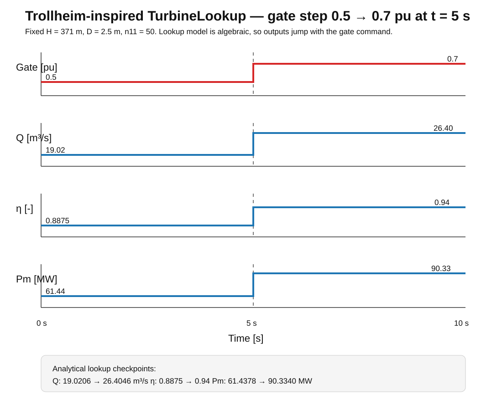

# Trollheim TurbineLookup Step Response

This note documents the first operating-point step test of the new
`TurbineLookup` component.

The purpose of this case is narrow and deliberate: isolate the turbine lookup
map from governor and shaft dynamics, then verify that a change in loading/gate
command produces the flow, efficiency, and mechanical-power changes predicted
by the hill-chart equations.

## Study setup

The model uses the Trollheim-inspired benchmark values already used elsewhere
in this repository:

| Quantity | Value |
|---|---:|
| Net head (H) | 371 m |
| Runner diameter (D) | 2.5 m |
| Unit speed (n_{11}) | 50 |
| Water density (
ho) | 1000 kg/m³ |
| Gravity (g) | 9.81 m/s² |
| Gate/loading before step | 0.5 pu |
| Gate/loading after step | 0.7 pu |
| Step time | 5 s |

The shaft speed is selected so that

[
n_{11}=rac{nD}{sqrt H}=50.
]

This corresponds to approximately

[
napprox 385.23 mathrm{rpm}.
]

The lookup component is algebraic in the present test. Therefore the turbine
outputs change immediately when the gate signal changes. A governor/servo will
later convert this ideal step into a finite-rate gate motion.

## Lookup relation

The turbine map returns (Q_{11}) and (eta) as functions of gate opening
and (n_{11}).

Actual discharge is reconstructed as

[
Q=Q_{11}D^2sqrt H.
]

Hydraulic power is

[
P_h=
ho gQH
]

and mechanical power is

[
P_m=eta P_h.
]

## Analytical pre-step point: gate = 0.5

At (n_{11}=50), bilinear interpolation gives

[
Q_{11}=0.158,
]

[
eta=0.8875.
]

Therefore

[
Q=0.158(2.5)^2sqrt{371}
  approx 19.0206 mathrm{m^3/s}.
]

Mechanical power is

[
P_m
=
0.8875(1000)(9.81)(19.0206)(371)
approx 61.4378 mathrm{MW}.
]

## Analytical post-step point: gate = 0.7

At (n_{11}=50), interpolation gives

[
Q_{11}approx0.21933777,
]

[
eta=0.94.
]

Hence

[
Qapprox26.4046 mathrm{m^3/s}
]

and

[
P_mapprox90.3340 mathrm{MW}.
]

## Step-response plot



The output jump is expected because no guide-vane servo dynamics are included
in this test. This is useful as a unit-level check: it verifies only the
lookup-table transformation and power equations.

## What the step tells us

The loading/gate step from 0.5 to 0.7 pu increases the lookup discharge from

[
19.0206 
ightarrow 26.4046 mathrm{m^3/s},
]

raises the interpolated efficiency from

[
0.8875 
ightarrow 0.94,
]

and increases mechanical shaft power from

[
61.4378 
ightarrow 90.3340 mathrm{MW}.
]

The important point is not the absolute plant prediction yet. The present
lookup table is a demonstration/Trollheim-inspired map, not measured Trollheim
hill-chart data. The purpose is to validate that the component transforms a
known table operating point into consistent hydraulic and mechanical outputs.

## Files

The executable example is:

```text
quick_examples/trollheim_turbine_lookup_step/step_response.jl
```

The analytical unit test is:

```text
test/test_turbine_lookup_step.jl
```

The plot used in this note is:

```text
docs/assets/turbine_lookup_step.svg
```

## Next extension

The natural next model is

```text
governor command
      ↓
guide-vane servo / rate limiter
      ↓
TurbineLookup
      ↓
shaft inertia
      ↓
generator/load
```

Then a 0.5 → 0.7 load request will no longer produce an instantaneous turbine
response. It will produce a physically meaningful gate trajectory, changing
flow, hydraulic power, shaft acceleration, and electrical power over time.
