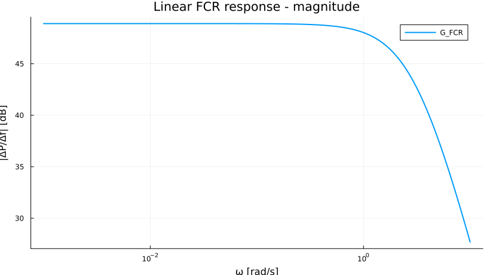
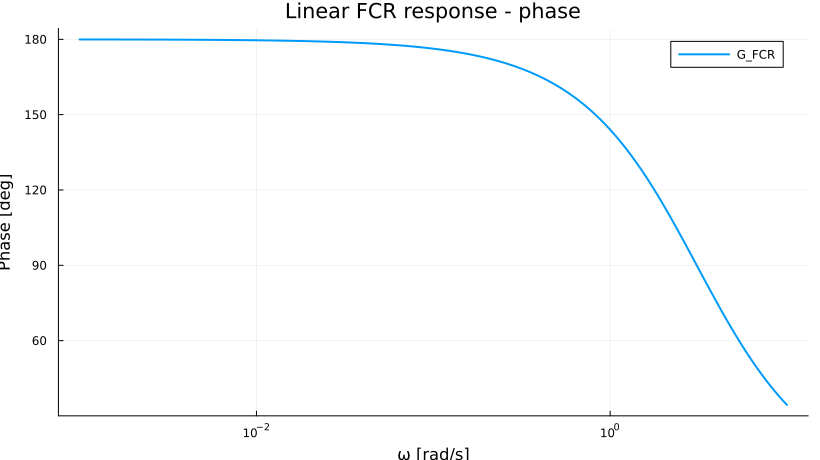
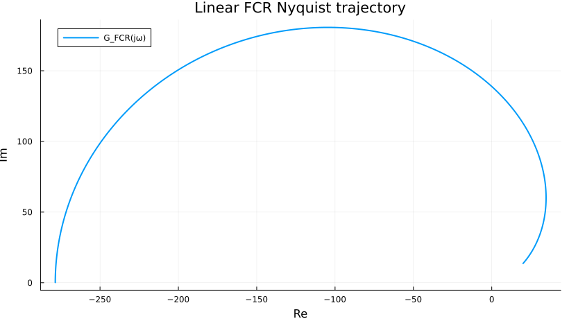
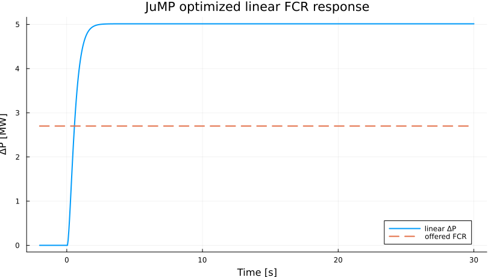
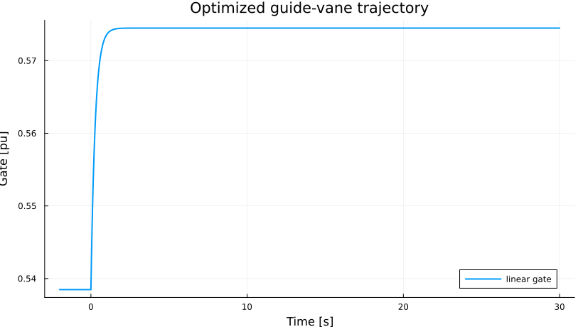
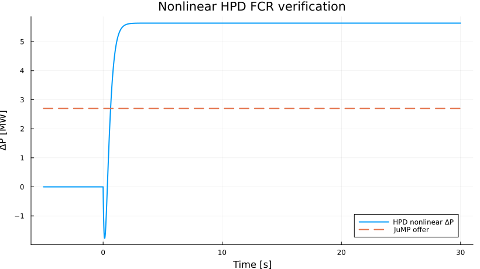
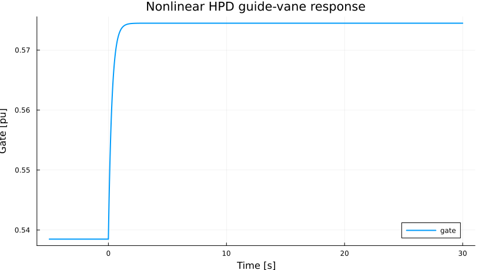
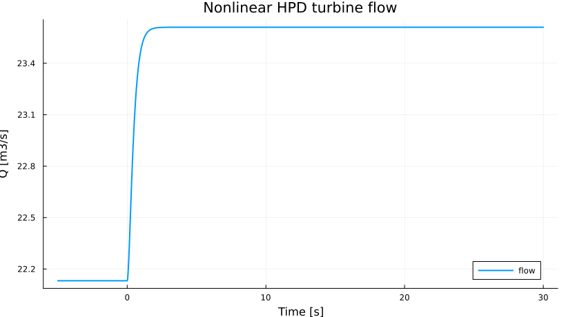
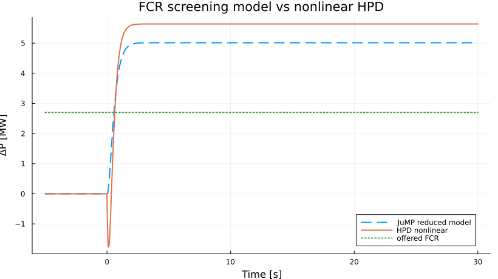

# FCR prequalification study

This folder implements one executable FCR screening and nonlinear verification workflow using `HydroPowerDynamics.jl`, `ControlSystemsBase.jl`, `JuMP.jl` and `Ipopt.jl`.

The engineering chain is

```text
nonlinear HPD plant
      -> reduced local model
      -> Bode / phase / Nyquist screening
      -> JuMP reserve-capacity search
      -> map candidate reserve to governor droop
      -> nonlinear HPD replay
      -> PASS / REDUCE / RETUNE
```

This is a **prequalification aid**, not an official Statnett qualification decision. The present test settings are transparent proxy limits used to demonstrate the workflow. Product-specific Nordic/Statnett trajectories, operating points, acceptance envelopes, measurement-path treatment and reporting requirements should be supplied later as an external qualification-data layer.

---

## 1. Research question

> **How much FCR can a hydropower unit offer at a given operating point while respecting actuator, hydraulic and dynamic-response limits, and can a cheap linear/JuMP screening result be trusted when replayed on the nonlinear HydroPowerDynamics.jl model?**

The workflow separates two engineering problems:

1. **screening:** find a candidate reserve cheaply;
2. **verification:** replay that candidate on the nonlinear hydraulic model before accepting it.

This replaces repeated manual droop tuning with a constrained search followed by one higher-fidelity validation layer.

---

## 2. Operating point and proxy test

The first study uses a Trollheim-inspired 150 MW hydro unit around

- `P_base = 150 MW`,
- `P0 = 75 MW`,
- `f0 = 50 Hz`,
- `y0 = 0.53848 pu`,
- `Q0 = 22.1375 m3/s`,
- gross head `H = 371 m`,
- governor actuator time constant `Tg = 0.30 s`.

The proxy disturbance is

$$
\Delta f(t)=
\begin{cases}
0, & t<0,\\
-0.10\ \mathrm{Hz}, & t\ge0.
\end{cases}
$$

The proxy requirement asks for at least 90% of the offered reserve after 5 s and approximately full delivery by the end of the 30 s test. These are **not claimed as present Statnett acceptance limits**.

---

## 3. Reduced linear model

The screening model uses normalized flow deviation and guide-vane position:

$$
\dot{\Delta q}
=
\frac{1}{T_w}
\left(\frac{\Delta y}{y_0}-\Delta q\right),
$$

$$
\dot{\Delta y}
=
\frac{1}{T_g}
\left(-K_f\Delta f-\Delta y\right),
$$

with

$$
\Delta P=P_0\Delta q.
$$

The water starting time is estimated as

$$
T_w=
\frac{L_hQ_0}{gA_hH}
+
\frac{L_pQ_0}{gA_pH}
\approx0.35\ \mathrm{s}.
$$

In state-space form,

$$
\dot x=Ax+B\Delta f,\qquad \Delta P=Cx,
$$

with

$$
x=
\begin{bmatrix}\Delta q\\\Delta y\end{bmatrix},
$$

$$
A=
\begin{bmatrix}
-1/T_w & 1/(T_wy_0)\\
0 & -1/T_g
\end{bmatrix},
\quad
B=
\begin{bmatrix}
0\\-K_f/T_g
\end{bmatrix},
\quad
C=
\begin{bmatrix}P_0&0\end{bmatrix}.
$$

This model is intentionally inexpensive. It is used for frequency-domain inspection and JuMP screening, not as the final physical truth.

---

## 4. JuMP problem formulation

The optimization variable is the offered reserve

$$
P_{\mathrm{FCR}}\ge0.
$$

The problem is

$$
\boxed{\max P_{\mathrm{FCR}}}
$$

subject to the discretized governor and hydraulic dynamics

$$
y_{k+1}
=
y_k+
\frac{\Delta t}{T_g}
\left(y_k^{cmd}-y_k\right),
$$

$$
q_{k+1}
=
q_k+
\frac{\Delta t}{T_w}
\left(\frac{y_k}{y_0}-q_k\right),
$$

where

$$
y_k^{cmd}
=
y_0-
\frac{P_{\mathrm{FCR}}}{P_0}
\frac{\Delta f_k}{\Delta f_{full}}.
$$

The plant constraints are

$$
y_{min}\le y_k\le y_{max},
$$

$$
q_{min}\le q_k\le q_{max},
$$

$$
-\dot y_{close}
\le
\frac{y_{k+1}-y_k}{\Delta t}
\le
\dot y_{open},
$$

and the response requirements are

$$
P_0(q_{5s}-1)\ge0.90P_{\mathrm{FCR}},
$$

$$
P_0(q_{end}-1)\ge0.98P_{\mathrm{FCR}}.
$$

Current proxy bounds are

$$
y\in[0.05,1.0],
\qquad
q\in[0.70,1.45],
$$

$$
|\dot y|\le0.12\ \mathrm{pu/s}.
$$

### Active constraint sanity check

Immediately after the frequency step,

$$
\dot y(0^+)\approx
\frac{P_{\mathrm{FCR}}/P_0}{T_g}.
$$

Therefore

$$
\frac{P_{\mathrm{FCR}}/75}{0.30}\le0.12,
$$

which gives

$$
\boxed{P_{\mathrm{FCR}}^*\approx2.7\ \mathrm{MW}}.
$$

The optimizer result matches this analytical estimate, so the candidate is physically interpretable rather than a black-box numerical number.

---

## 5. Executed JuMP result

The CI-executed notebook produced

| Quantity | Result |
|---|---:|
| JuMP candidate reserve | **2.7000 MW** |
| Candidate droop | **0.05556 pu/pu = 5.56%** |
| Linear 5 s delivery | **5.0141 MW** |
| Maximum gate | **0.5745 pu** |
| Maximum normalized flow | about **1.067 pu** |
| Maximum gate rate | approximately the **0.12 pu/s** limit |

The candidate reserve is therefore primarily limited by the **guide-vane opening-rate constraint**, not by total gate travel or flow headroom.

A notable result is that the reduced model delivers more incremental power than the nominal 2.7 MW reserve offer. This means the first screening formulation is conservative in its decision variable but does not yet enforce a tight tracking band around the offered FCR value. That mismatch is not hidden; it is treated as a model-formulation diagnostic.

A stronger next formulation should include an acceptance band such as

$$
\alpha_{min}P_{\mathrm{FCR}}
\le
\Delta P(t)
\le
\alpha_{max}P_{\mathrm{FCR}},
$$

or a weighted tracking objective, so that the optimized offer and delivered power are more directly comparable.

---

## 6. Mapping reserve to droop

The reserve candidate is mapped to primary droop by

$$
R^*
=
\frac{\Delta f_{full}/f_0}
{P_{\mathrm{FCR}}^*/P_0}.
$$

For the executed case,

$$
R^*
\approx
\frac{0.10/50}{2.7000/75}
\approx0.05556,
$$

or

$$
\boxed{R^*\approx5.56\%}.
$$

Integral action is disabled (`Ki = 0`) so this test isolates primary frequency response rather than secondary restoration.

---

## 7. Nonlinear HydroPowerDynamics.jl verification

The nonlinear replay uses

```text
Reservoir -> headrace -> penstock -> Francis turbine -> prescribed shaft-frequency boundary
                                      ^
                                      |
                                  FCR governor
```

The same frequency test is imposed at the shaft boundary. HPD then computes hydraulic flow, losses, turbine power and governor motion from the nonlinear component equations.

The nonlinear acceptance checks are

$$
\Delta P(5s)\ge0.90P_{\mathrm{FCR}}^*,
$$

$$
y_{min}\le y(t)\le y_{max},
$$

$$
q_{min}\le Q(t)/Q_0\le q_{max},
$$

$$
-\dot y_{close}\le\dot y(t)\le\dot y_{open}.
$$

### Executed nonlinear result

| Quantity | Nonlinear HPD result |
|---|---:|
| Candidate reserve | **2.7000 MW** |
| Delivery at 5 s | **5.6372 MW** |
| Final delivery | **5.6372 MW** |
| Maximum gate | **0.57448 pu** |
| Maximum flow / Q0 | **1.06653 pu** |
| Maximum gate rate | **0.11609 pu/s** |
| Engineering decision | **PASS** |

The nonlinear model therefore satisfies the present proxy gate, flow, rate and minimum-delivery checks.

The result is a **PASS for this proxy engineering test**, not an official FCR-N/FCR-D qualification.

---

## 8. Plot results and engineering interpretation

### 8.1 Linear Bode magnitude



The low-frequency gain represents the quasi-steady conversion from frequency deviation to mechanical power. The magnitude decreases as the disturbance becomes faster than the governor/hydraulic response. This illustrates why MW headroom alone is not sufficient for FCR qualification.

### 8.2 Linear Bode phase



The phase plot shows dynamic delay. Larger phase lag means mechanical-power support arrives later relative to the frequency event. In a later closed-loop grid model this becomes directly relevant to damping and robustness.

### 8.3 Nyquist trajectory



The Nyquist curve combines gain and phase in one plane. In this first notebook it is a diagnostic of the local linear model. With a full plant-grid loop it can be upgraded to explicit stability-margin analysis.

### 8.4 JuMP optimized linear response



The reduced model reaches roughly **5.01 MW at 5 s** while JuMP declares an offered reserve of **2.70 MW**. The candidate itself is limited by guide-vane rate. The over-delivery reveals that the present reduced formulation is conservative in `P_FCR` but loose in delivered-power tracking.

This is the main formulation issue to improve in the next notebook revision.

### 8.5 Optimized guide-vane trajectory



The guide vane moves from about `0.5385 pu` to about `0.5745 pu`. The early slope approaches the `0.12 pu/s` opening-rate bound, confirming that the actuator rate is the active capability constraint.

Operational interpretation: more FCR in this proxy case would require either more permissible gate rate, different governor tuning, or a less demanding response requirement.

### 8.6 Nonlinear HPD power verification



The nonlinear plant delivers about **5.64 MW at 5 s**, above both the required 90% threshold and the 2.70 MW candidate offer. The candidate therefore passes the present minimum-delivery check.

However, because the nonlinear plant also over-delivers, this plot reinforces the need for upper acceptance envelopes in a realistic prequalification implementation.

### 8.7 Nonlinear guide-vane response



The nonlinear maximum gate is **0.57448 pu**, nearly identical to the reduced-model endpoint. The maximum gate rate is **0.11609 pu/s**, below the `0.12 pu/s` proxy limit.

This is one of the strongest agreements between the cheap screening model and the nonlinear HPD replay.

### 8.8 Nonlinear turbine flow



The maximum turbine flow is only **1.06653 pu of Q0**, comfortably inside the proxy upper bound of `1.45 pu`. Hydraulic flow is therefore not the limiting constraint in this case.

The ranking of limits is approximately

```text
guide-vane rate  -> active / near-active
flow limit       -> inactive
gate travel      -> inactive
minimum delivery -> satisfied
```

### 8.9 Linear screening versus nonlinear physics



This is the central plot of the study.

At 5 s,

$$
\Delta P_{lin}\approx5.0141\ \mathrm{MW},
$$

while

$$
\Delta P_{NL}\approx5.6372\ \mathrm{MW}.
$$

The difference is

$$
\Delta P_{NL}-\Delta P_{lin}
\approx0.6231\ \mathrm{MW},
$$

or about **12.4% of the linear 5 s prediction**.

This is a moderate model mismatch rather than a catastrophic disagreement. The reduced model captures the actuator trajectory well, but it underestimates nonlinear mechanical-power delivery. For screening, this may be acceptable with a safety factor; for actual prequalification, the acceptance envelopes should be evaluated on the nonlinear model.

---

## 9. Engineering conclusion

For the present proxy FCR study,

$$
\boxed{P_{\mathrm{FCR}}^*=2.7000\ \mathrm{MW}}
$$

with

$$
\boxed{R^*=5.56\%}
$$

passes the nonlinear HydroPowerDynamics.jl verification.

The important finding is not simply the 2.7 MW number. The workflow also identifies **why** that number is limited:

$$
\boxed{\text{guide-vane opening rate is the active screening constraint}}
$$

while gate travel and hydraulic-flow bounds remain inactive.

The nonlinear plant delivers more power than the reduced model predicts, so the current screening model is useful but not yet a complete qualification surrogate.

---

## 10. Why JuMP helps

A manual workflow is often

```text
choose droop -> simulate -> inspect -> change droop -> repeat
```

This notebook changes the workflow to

```text
plant limits + test definition
          |
          v
JuMP finds a candidate reserve
          |
          v
nonlinear HPD verification
          |
          v
PASS / REDUCE / RETUNE + limiting constraint
```

The value of JuMP is therefore not to replace physical qualification. It reduces repeated manual search and exposes the active constraint before expensive/high-fidelity testing.

---

## 11. Generated artifacts

```text
quick_examples/fcr_prequalification_study/
├── FCR_Prequalification_Study.jl
├── FCR_Prequalification_Study.ipynb
├── README.md
├── plots/
│   ├── 01_linear_bode_magnitude.png
│   ├── 02_linear_bode_phase.png
│   ├── 03_linear_nyquist.png
│   ├── 04_jump_linear_response.png
│   ├── 05_jump_gate.png
│   ├── 06_nonlinear_power_verification.png
│   ├── 07_nonlinear_gate.png
│   ├── 08_nonlinear_flow.png
│   └── 09_linear_vs_nonlinear.png
└── results/
    ├── fcr_candidate_summary.csv
    └── fcr_validation_trajectory.csv
```

The executed notebook, plots and CSVs are generated automatically by GitHub Actions and committed back to the `FCR_study` branch.

---

## 12. Reproduce locally

```bash
julia --project=. -e 'using Pkg; Pkg.resolve(); Pkg.instantiate()'
pip install jupytext nbconvert jupyter
jupytext --to ipynb quick_examples/fcr_prequalification_study/FCR_Prequalification_Study.jl
jupyter nbconvert --to notebook --execute --inplace \
  quick_examples/fcr_prequalification_study/FCR_Prequalification_Study.ipynb \
  --ExecutePreprocessor.timeout=1800
```

---

## 13. Next formulation improvements

The next version should make the optimization closer to an actual prequalification evaluator by adding:

1. a lower **and upper** dynamic acceptance envelope;
2. exact product-specific FCR-N/FCR-D test trajectories;
3. multiple operating points `(P0,H,Q0)`;
4. asymmetric upward/downward reserve limits;
5. gate deadband, saturation and rate asymmetry;
6. optional surge-tank and elastic-waterway variants;
7. closed-loop grid interaction rather than only a prescribed frequency boundary;
8. a robust margin between the linear candidate and nonlinear verified capability.

Across operating points, the long-term target is a capability map

$$
P_{\mathrm{FCR,max}}
=
\Phi(P_0,H,Q_0,\theta_{gov},\theta_{hyd}).
$$

That map can support automatic screening, controller tuning and a Freki-type decision-support layer around HydroPowerDynamics.jl.
