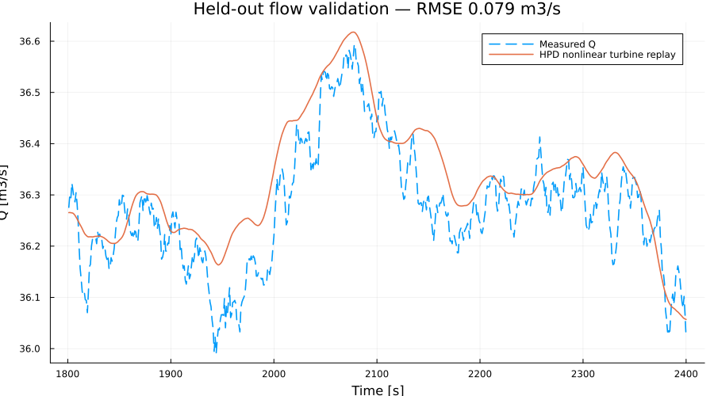
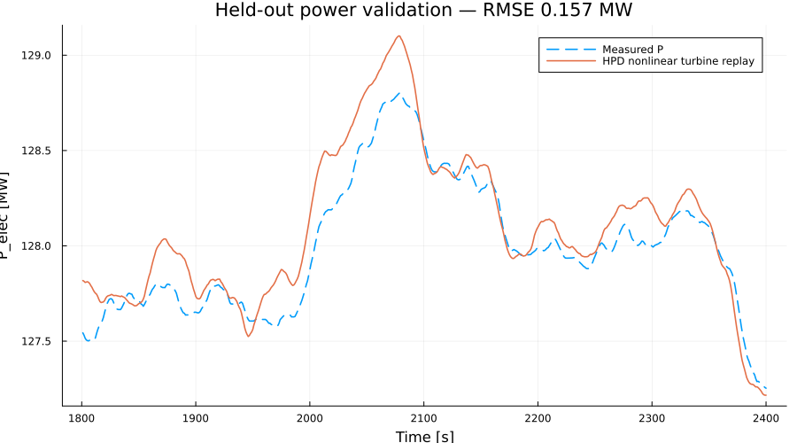
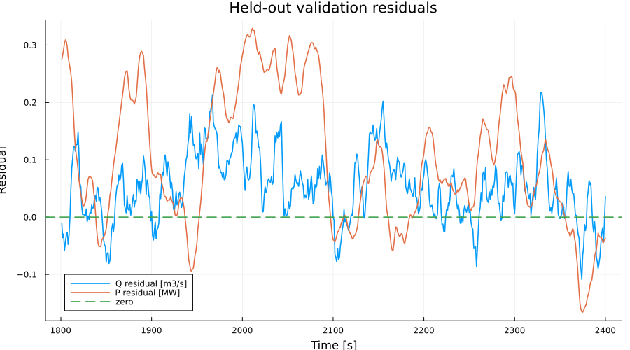
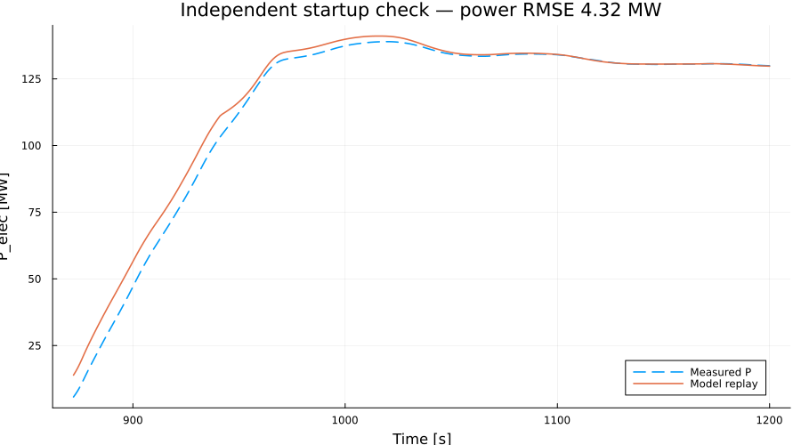

# FREKI Objective 1B — Trollheim measurement validation results

This note records the first executed measurement-based validation result for the Trollheim HPP data already available in this repository. It continues `TROLLHEIM_MEASUREMENT_VALIDATION.md` and should be read together with the executable script `objective_01b_trollheim_measurement_validation.jl`.

The purpose is not to claim FCR prequalification. The purpose is to decide which parts of the HydroPowerDynamics.jl plant model are already supported by measured plant data, which parts remain weakly identified, and what data should be collected before model-based FCR capability is trusted.

## 1. Executed study

The GitHub Actions workflow completed successfully and executed the full Objective 1B script on the processed one-hour Trollheim measurement record.

The data split was

```text
1200–1800 s   calibration
1801–2400 s   held-out steady-state validation
850–1200 s    independent startup check
```

The fitted turbine relation was

$$
Q=\tau_o K_qD^2\sqrt{H},
$$

$$
\eta=\eta_{max}\left[1-c_\eta\left(\frac{Q}{Q_r}-1\right)^2\right],
$$

$$
P_e=\eta_g\rho gQH\eta.
$$

No samples from the held-out validation interval were used to estimate the parameters.

## 2. Identified parameters

| Parameter | Identified value | Interpretation |
|---|---:|---|
| $K_q$ | 0.319751 | physically plausible flow coefficient |
| $\eta_{max}$ | 0.948071 | consistent with the measured high-load efficiency level |
| $Q_r$ | 36.4445 m3/s | close to the observed full-load discharge |
| $c_\eta$ | -1.84392 | **not physically credible as an efficiency-hill curvature** |

The first three quantities are reasonable. The negative $c_\eta$ is the important result.

It does not mean that the measured plant has a negative physical efficiency curvature. It means that the narrow high-load calibration interval does not contain enough off-design excitation to identify the curvature of the efficiency hill reliably. A least-squares fit can still reproduce the local measurements while returning a parameter that should not be used outside that local region.

This is exactly the distinction needed for a FREKI-style model-health tool:

```text
good output fit != all physical parameters are identified
```

## 3. Held-out validation

The model was then evaluated on the independent 1801–2400 s interval.

| Metric | Result |
|---|---:|
| Flow RMSE | **0.07945 m3/s** |
| Relative flow RMSE | **0.2190 %** |
| Electrical-power RMSE | **0.15704 MW** |
| Relative power RMSE | **0.1227 %** |
| Flow FIT | 33.91 % |
| Power FIT | 54.61 % |

The relative RMSE values are very small. Around this operating point the algebraic turbine conversion reproduces measured flow and power closely on data that were not used for fitting.

The normalized FIT values look much lower than the relative RMSE values because the held-out full-load record itself has only a small dynamic range. When the measured signal changes very little, even a small residual can be large relative to the signal's deviation from its mean. For this window, absolute and relative RMSE are therefore more useful than FIT alone.



**Interpretation.** The measured and modelled discharge should nearly overlap. This supports use of the fitted local flow relation around the measured full-load operating point.



**Interpretation.** The sub-0.2 MW RMSE is small compared with approximately 128 MW generation. The local turbine conversion from measured head and gate to power is therefore strong at this operating point.



**Interpretation.** Residuals should be inspected for bias, drift and correlation with head or gate. A small RMSE with structured residuals would still indicate missing physics.

## 4. Independent startup check

The same parameters were replayed on the startup interval, which is much farther from the calibration operating point.

| Metric | Result |
|---|---:|
| Startup flow RMSE | **0.14864 m3/s** |
| Startup power RMSE | **4.31884 MW** |



The flow error remains small, while the power error increases substantially compared with the steady-state held-out test. This is useful rather than disappointing: it identifies where the simple local turbine relation stops being sufficient.

Possible contributors include transient hydraulic effects, generator-efficiency assumptions, efficiency variation away from the calibrated full-load region, dynamic gate/turbine behaviour, and measurement timing/alignment. The current experiment does not distinguish these effects yet.

## 5. Correct model-health interpretation

The first script automatically labelled the turbine block `GREEN` because the held-out relative flow and power RMSE were both below 1 %. That is too optimistic if parameter plausibility is also considered.

A stronger engineering decision is:

| Model block | Evidence | Decision |
|---|---|---|
| Local turbine flow/power mapping near full load | excellent held-out RMSE | **GREEN locally** |
| Efficiency-hill curvature $c_\eta$ | negative fitted value; weak excitation | **AMBER** |
| Hydraulic dynamic model | pressure and flow are measured, but waterway dynamics have not yet been identified/replayed | **AMBER** |
| Governor model | speed and gate are measured, but controller mode/reference signals are missing | **AMBER / not uniquely identifiable** |
| FCR capability | complete dynamic chain not yet validated | **MORE DATA REQUIRED** |

Therefore the plant-level Objective 1B status should be interpreted as

```text
LOCAL TURBINE MAP     GREEN
TURBINE PARAMETER SET AMBER
HYDRAULIC DYNAMICS    AMBER
GOVERNOR DYNAMICS     AMBER
FCR READINESS          MORE DATA REQUIRED
```

This is more useful for a control engineer than a single PASS/FAIL label because it tells us exactly what is already trustworthy and what must be improved.

## 6. What the measurements already prove

The Trollheim record supports three practical conclusions.

First, measured head, guide-vane position, discharge and generator power are sufficient to calibrate a useful local Francis-turbine map around full load.

Second, held-out validation is important. The low validation errors show that the local map is not merely reproducing the calibration samples.

Third, parameter identifiability must be separated from output fit. The negative fitted $c_\eta$ shows that a model may predict the measured outputs well while one parameter remains physically untrustworthy.

That third point is directly relevant to FREKI. An online model-validation system should report both

$$
\text{prediction residuals}
$$

and

$$
\text{parameter identifiability / plausibility}.
$$

## 7. Next implementation

The next experiment should use the measured pressure and discharge signals to identify waterway dynamics rather than fitting another algebraic turbine parameter.

For a penstock segment,

$$
\frac{L}{A}\frac{d\dot m}{dt}
=
\Delta p
-
f_D\frac{L}{2D\rho A^2}\dot m|\dot m|.
$$

The Trollheim data already contain $p_{in}(t)$, $p_{out}(t)$ and $Q(t)$. The next script should therefore estimate an effective hydraulic parameter on a dynamic window and then replay the **nonlinear HPD waterway + turbine model** on a held-out startup or shutdown interval.

A practical sequence is

```text
measured p_in, p_out, Q
        |
        v
select dynamic window
        |
        v
identify effective f_D / hydraulic parameter
        |
        v
nonlinear HPD waterway replay
        |
        v
held-out pressure + flow residuals
        |
        v
GREEN / AMBER / RED hydraulic model health
```

Only after the hydraulic block is supported should the study move to unique governor identification. For that step, the preferred additional plant channels are governor frequency reference, power/set-point reference, controller mode, droop/transient-droop settings, and any internal servo command available from the control system.

## 8. FCR decision logic

The eventual chain should remain conservative:

```text
measured plant data
      -> local turbine validation
      -> hydraulic dynamic validation
      -> governor validation
      -> uncertainty region
      -> model-based FCR capacity screening
      -> selected physical plant tests
      -> Statnett / Nordic prequalification process
```

The role of HydroPowerDynamics.jl is to reduce unnecessary plant testing and expose the limiting physics before the formal test. It should not turn a locally fitted model into an automatic claim of qualification.

## Generated evidence

Numerical summary:

`results/objective_01b_summary.csv`

Held-out trajectory:

`results/objective_01b_validation_timeseries.csv`

Plots:

- `plots/01b_01_measurement_windows.png`
- `plots/01b_02_calibration_flow.png`
- `plots/01b_03_heldout_flow.png`
- `plots/01b_04_heldout_power.png`
- `plots/01b_05_residuals.png`
- `plots/01b_06_startup_power.png`
- `plots/01b_07_model_health.png`
