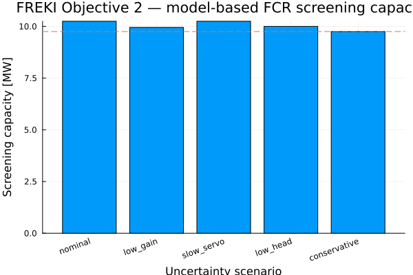
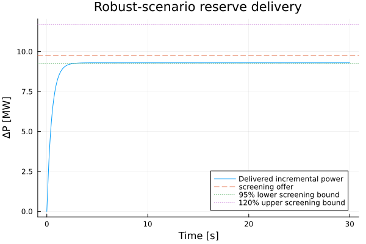
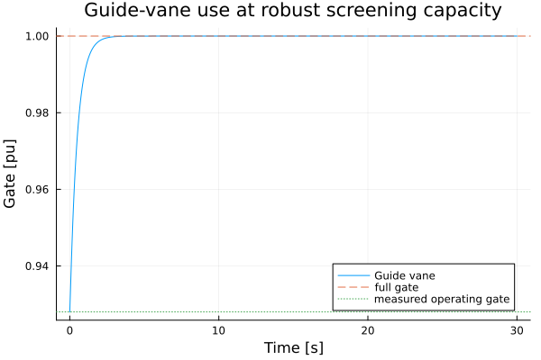
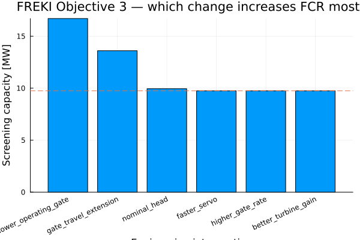
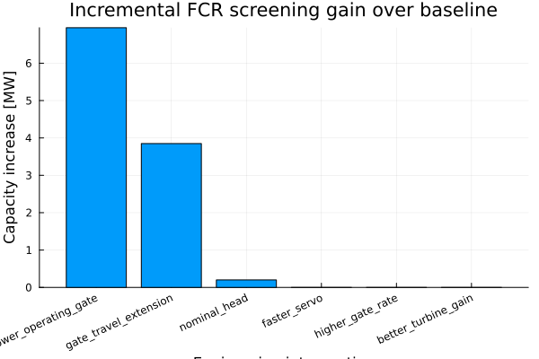
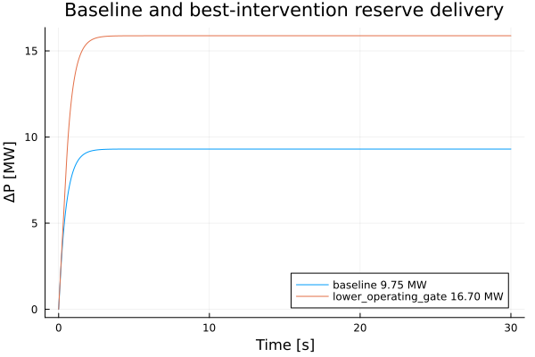
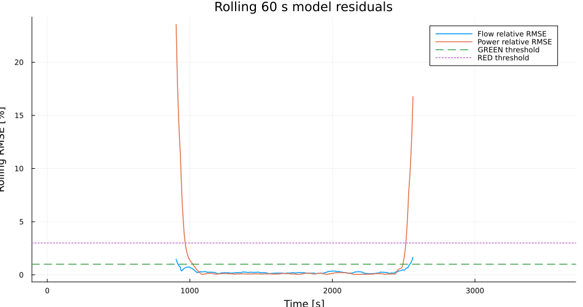
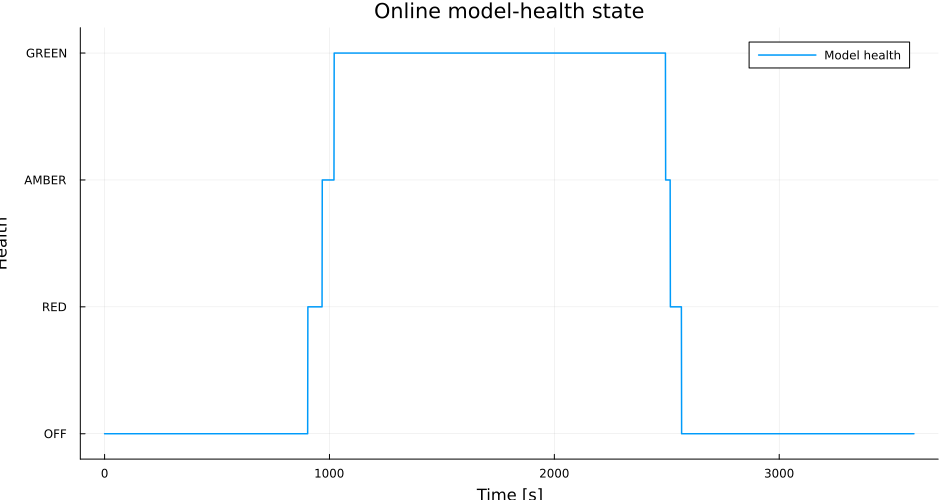
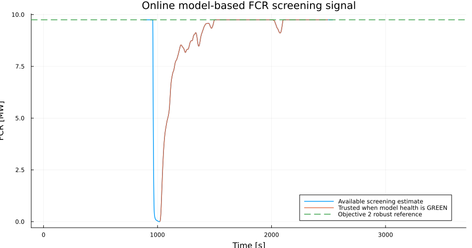

# FREKI with HydroPowerDynamics.jl — from plant measurements to an FCR decision

This folder is an end-to-end engineering demonstrator for the five SINTEF FREKI objectives using `HydroPowerDynamics.jl`. The central problem is practical: a hydropower producer wants to know whether a unit can provide Frequency Containment Reserve (FCR), how much reserve is credible, what limits the reserve, what should be changed to increase it, and whether the model remains trustworthy during operation.

The workflow is intentionally connected to the Statnett/Nordic prequalification process, but it does **not** replace that process. The calculations here are model-based engineering screening and evidence generation. A formal FCR qualification claim must still be based on the applicable Nordic/Statnett technical requirements, test program, plant documentation and physical tests.

```text
real plant measurements
        |
        v
Objective 1: validate model blocks and quantify uncertainty
        |
        v
Objective 2: estimate conservative FCR screening capacity
        |
        v
Objective 3: identify the physical/economic action that increases FCR
        |
        v
Objective 4: apply the same method to Francis / Pelton / Kaplan
        |
        v
Objective 5: monitor residuals and FCR capability continuously
        |
        v
candidate plant test -> Nordic / Statnett prequalification process
```

The important distinction throughout the work is

$$
\boxed{\text{model-based screening capacity} \neq \text{formally qualified FCR capacity}.}
$$

---

## The engineering problem

Suppose a Trollheim-like hydropower unit is operating close to full load and the owner wants to offer FCR to Statnett. The immediate commercial question is simple — *how many MW can we offer?* — but a credible answer requires several engineering questions to be solved in sequence.

First, the model must reproduce the plant. Second, uncertainty in the model must be carried into the reserve estimate. Third, the limiting plant mechanism must be identified. Fourth, the same methodology should work for other turbine technologies. Finally, if the model is used online, its validity must be checked continuously so that an FCR number is not trusted when the model has drifted away from the plant.

This repository turns those questions into five executable studies.

---

# Plant and control model

The Trollheim case is represented as a coupled hydraulic, mechanical and control system:

```text
Reservoir -> waterways -> Francis turbine -> shaft / generator -> electrical power
                              ^                         |
                              |                         v
                         guide vane <--- governor <--- frequency
```

The governor structure is

$$
e_f=\frac{\omega_{ref}-\omega}{\omega_{ref}},
$$

$$
\dot\xi=e_f,
$$

$$
u_{cmd}=u_0+\frac{e_f}{R}+K_i\xi,
$$

$$
T_g\dot u_g=\operatorname{sat}(u_{cmd})-u_g.
$$

The hydraulic side is not treated as a pure gain. Water inertia, pressure/head, flow, turbine conversion and actuator motion are relevant because FCR delivery is not only a governor problem. Statnett sees electrical power and frequency response at the grid connection, but whether the unit can deliver that response depends on the complete plant physics behind it.

---

# Objective 1 — Can the model be trusted before using it for FCR?

## 1A. Identification logic on a synthetic nonlinear plant

The first study tests the identification workflow on a nonlinear HPD plant where the true parameters are known. Small normal-operation perturbations are used instead of a large dedicated disturbance. The purpose is to test whether the model can be informed by ordinary plant data before moving to real measurements.

The workflow is

```text
small operating variations
      -> measurements
      -> parameter identification
      -> second nonlinear simulation
      -> held-out residual test
```

This is important for FREKI because a model should not be accepted merely because it can be fitted. It must predict data that were not used during fitting.

The synthetic work also exposed a useful methodological result: good output fit does not automatically mean that every physical parameter is identifiable. Weakly excited dynamics can produce apparently good predictions while returning unreliable parameter values. That distinction is essential before using a model to justify an FCR offer.

## 1B. Real Trollheim measurement validation

The next step uses the existing one-hour Trollheim measurement record. The measured channels include turbine inlet pressure, draft-tube pressure, head, discharge, guide-vane position, shaft speed and generator power.

The Francis turbine relation used locally is

$$
Q=\tau_o K_qD^2\sqrt H,
$$

$$
\eta=\eta_{max}\left[1-c_\eta\left(\frac{Q}{Q_r}-1\right)^2\right],
$$

$$
P_e=\eta_g\rho gQH\eta.
$$

The data are divided so that one interval is used for calibration and a different interval is held out for validation:

```text
1200–1800 s   calibration
1801–2400 s   held-out steady-state validation
850–1200 s    independent startup cross-check
```

The measured-data fit gives

| Quantity | Result |
|---|---:|
| $K_q$ | 0.319751 |
| $\eta_{max}$ | 0.948071 |
| $Q_r$ | 36.4445 m³/s |
| held-out flow RMSE | 0.07945 m³/s |
| relative flow RMSE | 0.219 % |
| held-out electrical-power RMSE | 0.15704 MW |
| relative power RMSE | 0.123 % |
| startup power RMSE | 4.31884 MW |

The local full-load turbine mapping is therefore strong, but one fitted parameter, $c_\eta=-1.84$, is not physically credible as an efficiency-hill curvature. The interpretation is not that the plant has an unusual negative hill curve. The correct interpretation is that this parameter is weakly identifiable from the narrow high-load operating region.

That leads to the first practical model-health decision:

```text
LOCAL TURBINE MAP      GREEN
TURBINE PARAMETER SET  AMBER
HYDRAULIC DYNAMICS     AMBER
GOVERNOR DYNAMICS      AMBER
FCR READINESS          MORE DATA REQUIRED
```

For Statnett-facing engineering this matters directly. Before using the model to reduce or replace plant testing, each model block that materially affects the FCR response must have enough evidence behind it. A locally accurate turbine map alone is not yet evidence that the complete frequency-control chain is validated.


Detailed measurement result: `OBJECTIVE_01B_RESULTS.md`.

---

# Objective 2 — How much FCR is worth taking to a plant test?

Once part of the model is supported by measurements, the next question is not immediately *how much is qualified?* The useful prequalification question is:

> How much FCR survives the current model uncertainty and plant-side limits strongly enough to justify deeper verification and physical testing?

Define the validated/credible model region as

$$
\Theta_{val}=\{\theta:J(\theta)\le J_{max}\}.
$$

For each admissible scenario, a candidate reserve is tested against actuator headroom, actuator rate and delivery constraints. The conservative screening quantity is

$$
P_{FCR}^{robust}
=
\min_{\theta\in\Theta_{val}}P_{FCR}^{max}(\theta).
$$

The executed Trollheim screening gives

$$
\boxed{P_{FCR}^{nominal}=10.25\ \mathrm{MW}}
$$

and

$$
\boxed{P_{FCR}^{robust}=9.75\ \mathrm{MW}}.
$$

The limiting uncertainty case is the conservative scenario. The roughly 0.5 MW reduction from nominal to robust capacity is the price of the uncertainty currently represented in the model.

The plant is operating around

$$
P_0\approx128.26\ \mathrm{MW},\qquad
H_0\approx384.9\ \mathrm{m},\qquad
y_0\approx0.928\ \mathrm{pu}.
$$

The high guide-vane position is important because only limited upward movement remains. Therefore the reserve calculation is already physically connected to the plant operating point rather than being only a governor gain calculation.

For a Statnett prequalification workflow, **9.75 MW should be interpreted as an engineering screening candidate**, not an approved bid volume. The current result explicitly remains

```text
MODEL-BASED ROBUST SCREENING  9.75 MW
FORMAL QUALIFIED CAPACITY     NOT ESTABLISHED
```

The next step toward a formal claim would be to validate the still-AMBER hydraulic/governor blocks and then expose the resulting model to the applicable Nordic/Statnett FCR test sequence and physical plant test.







---

# Objective 3 — What should the plant owner change to increase FCR?

A screening result is much more useful if it explains *why* the reserve stops at that number. Objective 3 therefore converts the model into an engineering decision tool.

The capacity is treated as a function of controller, actuator, operating point and hydraulic conditions:

$$
P_{FCR}^{max}
=F(R,T_g,K_i,\dot y_{max},P_0,H,\theta_h,\ldots).
$$

Different interventions are tested one at a time. Examples include faster servo response, increased guide-vane rate, more actuator travel, different head and a lower initial operating point.

The strongest intervention in the executed study is **lowering the operating gate**. Starting from the robust 9.75 MW screening value, the best tested case gives

$$
\boxed{P_{FCR}^{screen}=16.7\ \mathrm{MW}},
$$

which is an increase of

$$
\boxed{6.95\ \mathrm{MW}\;\;(71.3\%)}.
$$

The remaining binding mechanism is still gate headroom.

This gives a practical plant-owner interpretation: when the unit is already close to full gate, the main FCR limitation may not be controller speed. The more valuable intervention can be to create upward operating headroom by scheduling the plant slightly below its maximum generation point.

That immediately creates a market/economic problem that is directly relevant to participation in Statnett reserve markets:

$$
\max_{P_0,P_{FCR}}
\left[
R_{energy}(P_0)
+R_{FCR}(P_{FCR})
-C_{water}
-C_{wear}
\right].
$$

In other words, the engineering question becomes an operational bidding question: *is the additional FCR revenue worth the energy revenue sacrificed by operating below maximum power?* This is the natural bridge between FREKI model validation, plant operation and reserve-market decision support.

The 16.7 MW value is still a screening result. A producer should not offer it to Statnett solely from this model. The model says which intervention is worth investigating and which reserve volume is worth taking forward to the proper verification/test process.







---

# Objective 4 — Does the same method work for Francis, Pelton and Kaplan?

Statnett does not procure "Francis FCR" or "Pelton FCR" as separate products; it procures a frequency-response service. However, the internal plant physics that produce the service differ strongly by turbine type. FREKI therefore needs a common qualification methodology with turbine-specific internal models.

The software structure is

```text
same reserve request
        |
        +--> Francis: guide vane + waterway / surge dynamics
        |
        +--> Pelton: needle / deflector + jet dynamics
        |
        +--> Kaplan: guide vane + blade-pitch coordination
        |
        v
same external validation metrics
```

The common metrics include rise/delivery time, delivered power after specified times, overshoot, steady reserve and actuator use. The intended common API is

```julia
simulate(model, inputs, parameters)
validate(measurements, prediction)
estimate_fcr(validated_model, requirements)
```

Trollheim/Francis is the measurement-anchored case. Pelton and Kaplan are currently canonical benchmark implementations for methodology comparison; they are **not** presented as measurement-validated plants. That distinction is important if this framework is used with Statnett or a producer: synthetic turbine-type comparisons demonstrate portability of the method, while a qualification argument requires plant-specific evidence.

Objective 4 implementation: `objective_04_multiturbine_validation.jl`.

---

# Objective 5 — Can the model-health decision run continuously?

A model that was valid during commissioning may become less accurate as head, operating point, actuator behaviour or plant condition changes. Therefore an online model-based FCR estimate should never be displayed without a simultaneous model-health signal.

Objective 5 replays the real Trollheim record sample by sample and computes rolling residuals. For a rolling window,

$$
r_k=y_k-\hat y_k,
$$

and the monitor tracks quantities such as

$$
RMSE_Q,\qquad RMSE_P.
$$

The resulting health logic is

```text
GREEN  model residuals inside trusted range
AMBER  mismatch increasing / evidence weak
RED    do not trust the model for FCR screening
```

The available upward screening signal is calculated continuously as

$$
P_{FCR}^{screen}(t)
=
\min\left[
P_{FCR}^{robust},
P_{headroom}(t)
\right].
$$

But the number is treated as trusted only while model health is GREEN.

The executed offline replay uses 3600 real Trollheim samples and a 60 s rolling window. Among evaluated windows:

| Health state | Samples |
|---|---:|
| GREEN | 1474 |
| AMBER | 74 |
| RED | 114 |

The GREEN fraction is approximately

$$
\boxed{88.7\%}.
$$

During GREEN periods, the median and maximum trusted screening value remain

$$
\boxed{9.75\ \mathrm{MW}}.
$$

This is not yet a live SCADA connection. It is an **offline replay of real Trollheim measurements** that demonstrates the logic required for a future online service.

For a Statnett-connected operational workflow, the value of this monitor is not that it automatically changes a formally qualified FCR volume. Its value is that it can warn the operator when the model underpinning an operational reserve estimate is no longer trustworthy, and can trigger revalidation, retuning or a new plant test before the unit is relied upon for reserve delivery.







---

# End-to-end decision chain

The five studies now solve one connected problem rather than five independent examples.

```text
1. Can I trust the plant model?
      |
      +--> measured Trollheim data
      +--> held-out residual test
      +--> GREEN / AMBER / RED by model block
      |
      v
2. What FCR volume is worth testing?
      |
      +--> nominal = 10.25 MW
      +--> robust screening = 9.75 MW
      +--> formal qualification = NOT ESTABLISHED
      |
      v
3. Why is the FCR limited, and what should I change?
      |
      +--> gate headroom is dominant
      +--> lower operating point
      +--> screening rises to 16.7 MW
      |
      v
4. Can the same method be reused on another turbine technology?
      |
      +--> Francis / Pelton / Kaplan interface
      +--> same external reserve metrics
      |
      v
5. Can I trust the result tomorrow as well as today?
      |
      +--> rolling residuals
      +--> 88.7% GREEN in the Trollheim replay
      +--> trusted screening only when model health is acceptable
      |
      v
6. Take the justified candidate to the applicable Nordic / Statnett
   prequalification and physical plant-test process.
```

The intended role of `HydroPowerDynamics.jl` is therefore not to replace Statnett testing. It is to make the work before, during and after testing more efficient: decide what model is trustworthy, select a sensible candidate FCR volume, identify the plant mechanism that limits it, choose the most valuable engineering action, and monitor whether the model remains valid afterwards.

---

# Practical interpretation for a producer, consultant or TSO-facing engineer

A producer can use this workflow before requesting or repeating a prequalification test. Instead of trying an arbitrary reserve volume on the plant, the engineer first uses normal-operation and historical measurements to validate the relevant model blocks. The model then screens a candidate volume and exposes the active constraint. If the candidate is too low, the plant owner can test whether retuning, actuator improvement or a different operating point has real value before modifying hardware.

For a consultant or model developer, the same framework creates traceable evidence. Every reserve number has a path back to measurements, assumptions, uncertainty scenarios and residuals. A statement such as "9.75 MW is a robust screening value" is therefore different from "9.75 MW is qualified by Statnett"; only the latter requires completion and acceptance of the formal process.

For Statnett-facing work, the final model-based candidate must be mapped to the **current** Nordic/Statnett technical requirements and test program for the relevant FCR product. Requirements, test sequences, response envelopes, stability criteria and documentation should be taken from the applicable official documents at the time of the test. Any engineering limits used inside these examples are labelled as plant-side or study assumptions and must not be confused with Statnett requirements.

---

# Repository outputs

Main executable studies:

```text
objective_01_model_validation.jl
objective_01b_trollheim_measurement_validation.jl
objective_02_fcr_capacity.jl
objective_03_increase_fcr.jl
objective_04_multiturbine_validation.jl
objective_05_online_monitor.jl
```

Key numerical outputs:

```text
results/objective_01b_summary.csv
results/objective_02_summary.csv
results/objective_02_scenarios.csv
results/objective_03_summary.csv
results/objective_03_ranking.csv
results/objective_05_summary.csv
results/objective_05_online_timeseries.csv
```

Run locally with

```bash
julia --project=. -e 'using Pkg; Pkg.instantiate()'
julia --project=. quick_examples/freki_objectives/objective_01b_trollheim_measurement_validation.jl
julia --project=. quick_examples/freki_objectives/objective_02_fcr_capacity.jl
julia --project=. quick_examples/freki_objectives/objective_03_increase_fcr.jl
julia --project=. quick_examples/freki_objectives/objective_04_multiturbine_validation.jl
julia --project=. quick_examples/freki_objectives/objective_05_online_monitor.jl
```

GitHub Actions workflows execute the same studies and commit generated plots and CSV summaries back to the `AGC_Trollheim` branch when the runs succeed.

---

# Current evidence status

```text
Trollheim local turbine map       GREEN
Turbine parameter identifiability AMBER
Hydraulic dynamic validation      AMBER
Governor dynamic validation       AMBER
Objective 2 screening capacity    9.75 MW robust
Objective 3 best tested screening 16.7 MW after lower operating point
Online model health               88.7% GREEN in evaluated replay windows
Formal FCR qualification          NOT ESTABLISHED
```

This status is deliberately conservative. The next technical work should strengthen hydraulic and governor identification, map the validated nonlinear model directly to the applicable Nordic/Statnett FCR test sequence, and then compare model prediction against a controlled physical plant test.

---

# References

1. SINTEF, **FREKI**, Innovation Project for the Industrial Sector, 2024–2026.
2. Nordic TSOs / Statnett, **Technical Requirements for Frequency Containment Reserve Provision in the Nordic Synchronous Area**.
3. Nordic TSOs / Statnett, **Test Program for Prequalification of FCR in the Nordic Synchronous Area**.
4. `HydroPowerDynamics.jl`, branch `AGC_Trollheim`.
