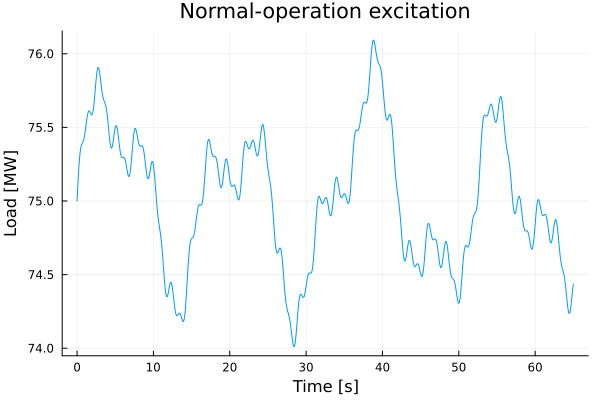
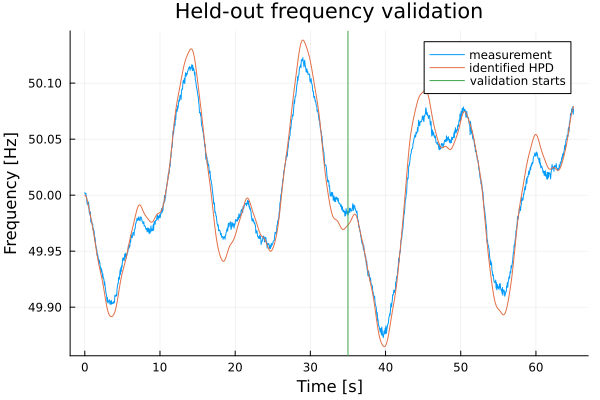
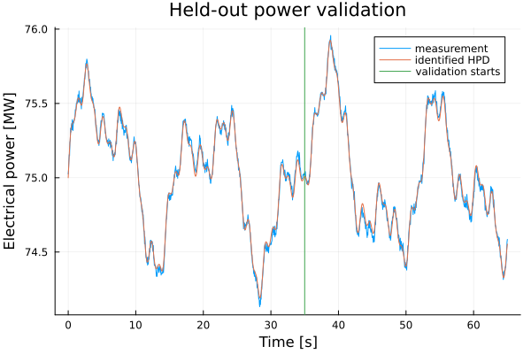
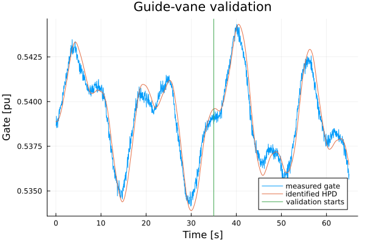
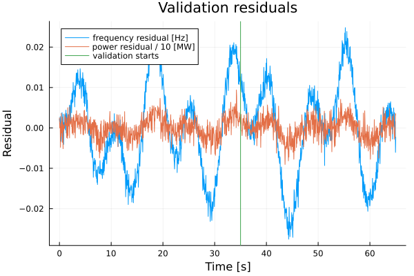
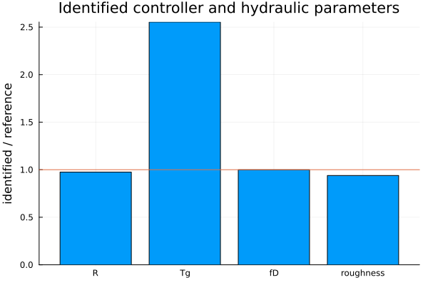

# FREKI objectives with HydroPowerDynamics.jl

This folder uses the nonlinear Trollheim-inspired AGC model in `HydroPowerDynamics.jl` to turn the five SINTEF FREKI objectives into small executable studies.

The purpose is **not** to claim official Statnett prequalification. The purpose is to test a model-based engineering route from normal operating data to validated hydropower dynamics and, later, to FCR capability.

```text
normal plant operation
        |
        v
measurements -> validate HPD model -> quantify uncertainty
                                      |
                                      v
                              estimate FCR capability
                                      |
                                      v
                              identify limiting physics
                                      |
                                      v
                               engineering action
```

Reference project: SINTEF FREKI, 2024-2026.

---

## Plant used in this branch

The existing `AGC_Trollheim` branch provides

```text
Reservoir -> headrace -> [surge tank] -> penstock -> Francis turbine
                                                   |
                                                   v
                                             rotating mass
                                                   |
                                                   v
                                            generator / load
                                                   ^
                                                   |
                                             governor / AGC
                                                   ^
                                                   |
                                                speed
```

The reusable governor in `src/agc.jl` is

$$
e_f=\frac{\omega_{ref}-\omega}{\omega_{ref}},
$$

$$
\dot\xi=e_f,
$$

$$
u_{cmd}=u_0+\frac{e_f}{R}+K_i\xi,
$$

$$
T_g\dot u_g=\operatorname{sat}(u_{cmd})-u_g.
$$

The hydraulic side retains water inertia, friction, turbine flow and mechanical power. This matters because a useful FCR model must explain both the controller response and the hydraulic response.

---

# 1. Validate the model from normal operation

### FREKI question

Can the power-plant model be validated from ordinary operating measurements without a dedicated disturbance test?

### Executable first study

`objective_01_model_validation.jl` generates synthetic measurements from the nonlinear HPD plant while electrical load moves only by small smooth amounts around 75 MW:

$$
P_L(t)=P_0+
0.55\sin\left(\frac{2\pi t}{17}\right)+
0.30\sin\left(\frac{2\pi t}{7.5}\right)+
0.15\sin\left(\frac{2\pi t}{31}\right)\ \mathrm{MW}.
$$

Small seeded measurement noise is added to

$$
y_m=[f,\;P_e,\;u_g,\;Q].
$$

The first implementation identifies only

$$
\boxed{\theta=[R,T_g]}
$$

because these two parameters can be estimated transparently from the measured governor motion before introducing hydraulic parameter identification.

When the gate is not saturated,

$$
T_g\dot u_g=u_0+K_i\xi-u_g+\frac{e_f}{R}.
$$

Define

$$
a=\frac{1}{T_g},
\qquad
b=\frac{1}{T_gR}.
$$

Then

$$
\dot u_g=
 a(u_0+K_i\xi-u_g)+b e_f,
$$

which is a linear least-squares identification problem. After estimating $a$ and $b$,

$$
\boxed{T_g=\frac{1}{a}},
\qquad
\boxed{R=\frac{a}{b}}.
$$

The first 35 s are used for estimation. The interval 35-65 s is held out for validation. The identified parameters are then replayed in a **second nonlinear HPD simulation**; validation data are not used for fitting.

### Validation metrics

The script reports

| Metric | Purpose |
|---|---|
| RMSE frequency | frequency-response mismatch |
| RMSE electrical power | active-power mismatch |
| RMSE gate | actuator mismatch |
| RMSE turbine flow | hydraulic mismatch |
| FIT frequency | normalized dynamic fit |
| FIT electrical power | normalized power fit |
| parameter error | identified vs known synthetic truth |

### Generated plots













Generated numerical files:

```text
results/objective_01_summary.csv
results/objective_01_timeseries.csv
```

### What this proves — and what it does not

A successful run demonstrates the workflow

```text
normal excitation
    -> measurements
    -> identify controller parameters
    -> nonlinear HPD replay
    -> held-out residual test
```

It does **not** yet show that real Trollheim measurements have been validated. The present data are synthetic and the plant constants are Trollheim-inspired benchmark values.

The next extension of Objective 1 is to identify hydraulic parameters such as effective water starting time/friction from measured $Q$, head/pressure and power.

---

# 2. Determine FCR from the verified model

### FREKI question

Once the model is trusted, how much FCR can the unit safely offer?

Use the validated nonlinear model and its uncertainty region

$$
\Theta_{val}=\{\theta:J(\theta)\le J_{max}\}.
$$

For each admissible model, solve the FCR-capability problem

$$
\max P_{FCR}
$$

subject to the applicable response envelope and plant limits such as

$$
y_{min}\le y(t)\le y_{max},
\qquad
|\dot y(t)|\le\dot y_{max},
\qquad
Q_{min}\le Q(t)\le Q_{max}.
$$

A conservative model-based capability is

$$
\boxed{
P_{FCR}^{robust}
=
\min_{\theta\in\Theta_{val}}
P_{FCR}^{max}(\theta)
}.
$$

This connects directly to the existing `FCR_study` work, but the qualification envelope must come from the relevant current Nordic/Statnett requirements rather than proxy limits.

---

# 3. Identify measures that increase FCR

### FREKI question

What should be changed when the plant cannot qualify the desired FCR volume?

Treat capability as

$$
P_{FCR}^{max}=F(R,T_g,K_i,\dot y_{max},P_0,H,T_w,\theta_h,\ldots).
$$

Then vary controller, actuator, operating-point and hydraulic parameters and report the active constraint.

The decision output should be practical:

| Limiting mechanism | Candidate action |
|---|---|
| guide-vane rate | controller/servo review |
| governor tuning | retune `R`, transient droop or related parameters |
| hydraulic oscillation | retain/retune waterway and surge-tank dynamics |
| flow/head constraint | change operating point or reserve offer |
| model uncertainty | collect more informative operating data |

The desired logic is

```text
FAIL -> limiting mechanism -> engineering action -> new FCR capability
```

---

# 4. Validate across Francis, Pelton and Kaplan

Keep the external frequency-control interface common while changing the turbine/actuator physics.

| Turbine | Main actuator | Important dynamics |
|---|---|---|
| Francis | guide vane | penstock + surge dynamics |
| Pelton | needle / deflector | jet and actuator response |
| Kaplan | guide vane + blade pitch | coordinated two-actuator response |

A common software interface is the target:

```julia
simulate(model, inputs, parameters)
validate(measurements, prediction)
estimate_fcr(validated_model, requirements)
```

The current Trollheim-inspired Francis model is the first case.

---

# 5. Demonstrate online with real-time data

### FREKI question

Can model validity and available FCR be checked continuously?

For each moving data window,

$$
\hat x_{k+1}=F(\hat x_k,u_k,\hat\theta_k),
$$

$$
r_k=y_k-\hat y_k.
$$

Track residual metrics such as

$$
RMSE_f,\quad RMSE_P,\quad RMSE_Q,\quad RMSE_y
$$

and attach a simple model-health state:

```text
GREEN  residuals inside validated band
AMBER  mismatch increasing
RED    model not trusted for FCR estimation
```

The eventual online chain is

```text
live measurements
      +-----> HPD prediction
      |            |
      +------> residuals
                   |
                   v
              model health
                   |
                   v
          estimated FCR capacity
```

---

# Study sequence

```text
Objective 1  model validation from normal operation
     |
     v
Objective 2  FCR capacity + model uncertainty
     |
     v
Objective 3  limiting mechanism + improvement
     |
     v
Objective 4  Francis / Pelton / Kaplan
     |
     v
Objective 5  online residual and capability monitor
```

## Run Objective 1 locally

```bash
julia --project=. -e 'using Pkg; Pkg.instantiate()'
julia --project=. quick_examples/freki_objectives/objective_01_model_validation.jl
```

The GitHub Actions workflow executes the same script and commits the generated plots and CSV summaries back to `AGC_Trollheim` when the run succeeds.

---

# References

1. SINTEF, **FREKI**, Innovation Project for the Industrial Sector, 2024-2026.
2. Nordic TSOs / Statnett, **Technical Requirements for Frequency Containment Reserve Provision in the Nordic Synchronous Area**.
3. Nordic TSOs / Statnett, **Test Program for Prequalification of FCR in the Nordic Synchronous Area**.
4. `HydroPowerDynamics.jl`, branch `AGC_Trollheim`.
